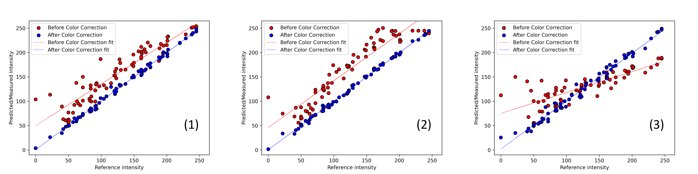

# ColorCorrectionML

ColorCorrectionML is a Python package for color correction of images using machine learning. It uses ML regression methods (linear, least sqaure, and partial least squares regression) to learn the color correction function from a training image with a color checker. The learned function is then applied to correct the color of a test image.

## Installation
```shell
pip install colorcorrectionml
```

## Usage
```python
from colorcorrectionml import ColorCorrectionML
import cv2

img = cv2.imread('Images/img2.png')

cc = ColorCorrectionML(img, chart='Classic', illuminant='D50')

method = 'pls' # 'linear', 'lstsq', 'pls' 
# for linear regression, least square regression, and partial least square regression respectively
show = True

kwargs = {
    'method': method,
    'degree': 3, # degree of polynomial
    'interactions_only': False, # only interactions terms,
    'ncomp': 10, # number of components for PLS only
    'max_iter': 5000, # max iterations for PLS only
    'white_balance_mtd': 0 # 0: no white balance, 1: learningBasedWB, 2: simpleWB, 3: grayWorldWB,
    }

M, patch_size = cc.compute_correction(
    show=show,
    **kwargs
)
    

# resize img by 2
# img = cv2.resize(img, (0,0), fx=0.3, fy=0.3, interpolation=cv2.INTER_AREA)

img_corr = cc.correct_img(img, show=True)
# img_corr = cc.Parallel_correct_img(img, chunks_=50000, show=True)
```

## Example results
Scatter plot of the original image and the corrected image color values


Color correction results


## TODO
1. Add other reference color values (D55, D65, D70, D75)
2. Add other color charts (ColorChecker24, ColorCheckerSG, ColorCheckerDC)
3. Add other color spaces (CIELab, CIELuv, CIELCH, CIELCHuv, CIECAM02, etc.)
4. Add other regression methods (Ridge, Lasso, ElasticNet, etc.)
5. Refine the white balance methods
