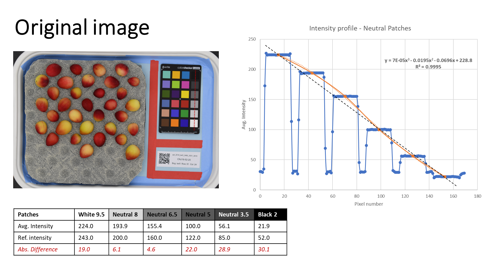
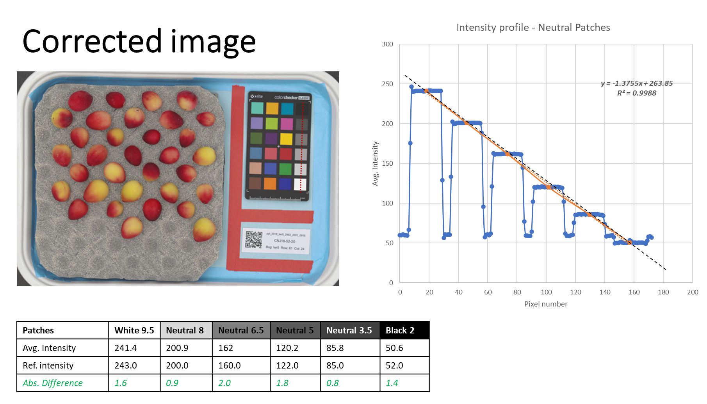
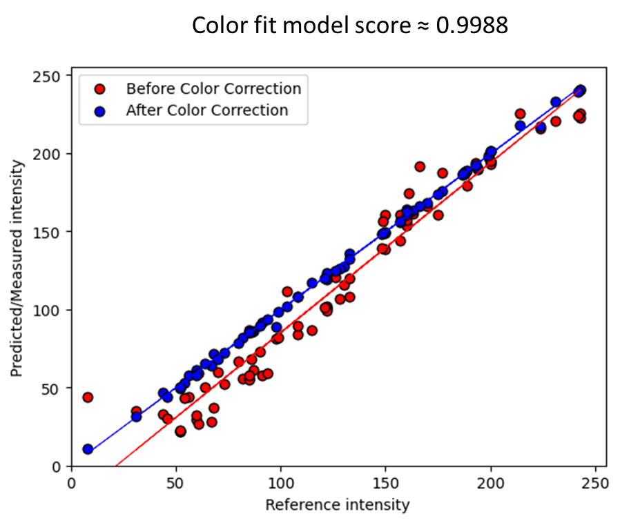
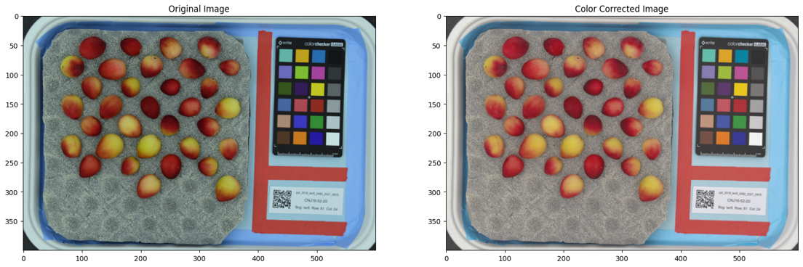

# Image Color Correction using Machine Learning #
This is a repo for color correction of images using machine learning. The code uses opencv to detect and extract values from the color patches in the image. The extracted values and the reference values are then used to train a ML partial least square [PLS-2](https://scikit-learn.org/stable/modules/generated/sklearn.cross_decomposition.PLSRegression.html) model to predict the color correction values in a new image. This repo is built upon the work of [Navarasu](https://blog.francium.tech/using-machine-learning-for-color-calibration-with-a-color-checker-d9f0895eafdb).

## Requirements ##
* Python => 3.9
* OpenCV
* Scikit-learn
* Numpy
* Matplotlib

## How it works ##
The backbone of the code is the `ColorCorrection` class in the `color_correction.py` file. The class has the following methods:
1. `get_patches_sizes`: This method returns the size of the color patches in the image.
2. `extract_color_chart`: This method detects and extracts the color patches from the image. It uses the [mcc module](https://docs.opencv.org/4.x/dd/d19/group__mcc.html) in opencv to detect the color patches. The method returns the color patch locations and values in the image.
3. `do_white_balance`: This method does the white balance correction on the image. It uses the [grayworld algorithm](https://docs.opencv.org/4.x/d3/dc1/group__imgproc__color__conversions.html#ga4e0972be5de079fed4e3a10e24ef5ef0) in opencv to do the white balance correction.
4. `run_corection`: This method runs the color correction on the image. It uses the extracted color patch values and the reference values to train a PLS-2 model. The model is then used to predict the color correction values for the image. The predicted values are then used to correct the image.

## Usage ##
* Clone the repo
* Install the requirements using `pip install -r requirements.txt`
* Run the `color_correction_folder.py` file to correct the images in a folder. Or run the `color_correction_single.ipynb` file to correct a single image. Both files depend on the `color_correction.py` file.

#### *Note:*
  * *The color correction model can be saved and can be used to correct images (collected under the same lighting conditons) in the future.*
  * *The Reference values are taken from the [xrite](https://xritephoto.com/documents/literature/en/ColorData-1p_EN.pdf) and [babel](https://babelcolor.com/index_htm_files/RGB%20Coordinates%20of%20the%20Macbeth%20ColorChecker.pdf) color charts. The values are in the sRGB color space.*

## Results ##

### Reference vs Original vs Predicted color values ###

## Images Before and After Correction ###

## References ##
* [Navarasu](https://blog.francium.tech/using-machine-learning-for-color-calibration-with-a-color-checker-d9f0895eafdb)
* [xrite](https://xritephoto.com/documents/literature/en/ColorData-1p_EN.pdf)
* [babel](https://babelcolor.com/index_htm_files/RGB%20Coordinates%20of%20the%20Macbeth%20ColorChecker.pdf)
* [opencv mcc module](https://docs.opencv.org/4.x/dd/d19/group__mcc.html)
* [opencv grayworld algorithm](https://docs.opencv.org/4.x/d3/dc1/group__imgproc__color__conversions.html#ga4e0972be5de079fed4e3a10e24ef5ef0)
* [scikit-learn PLS-2](https://scikit-learn.org/stable/modules/generated/sklearn.cross_decomposition.PLSRegression.html)
